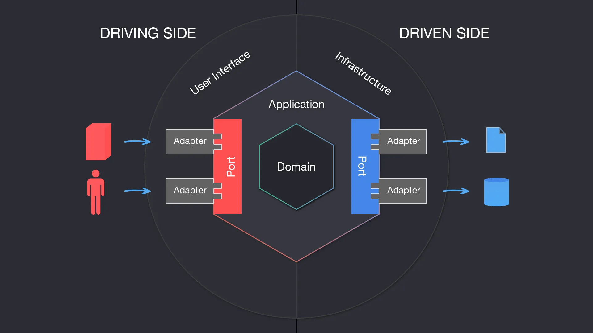
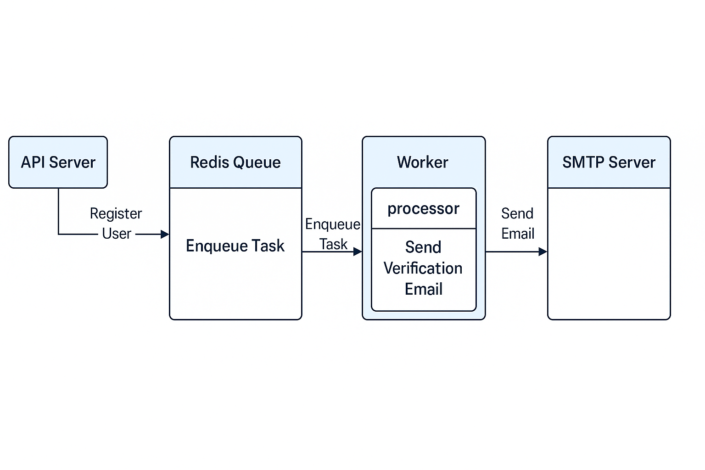
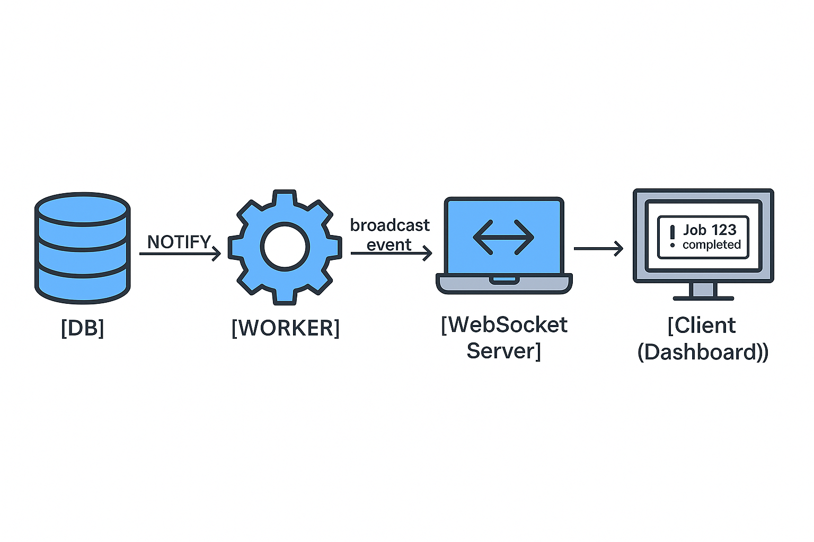
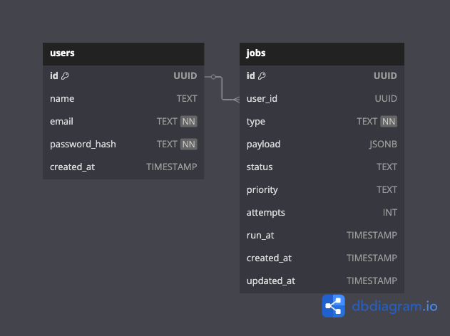

# 🚀 GoQueue – Scalable Job Queue & Task Processing System in Golang

GoQueue is a production-ready, event-driven Job Queue system built with **Golang** and **PostgreSQL**. It’s designed to teach you how to build clean, secure, and scalable backends — with background jobs, scheduling, retries, and real-time updates.

---

## 🧠 Project Objective

> Build a secure, multi-user job queue system where authenticated users can enqueue tasks, track their job statuses, and receive real-time updates when jobs complete — all in pure Go + PostgreSQL.

---

## 📦 Project Structure (Hexagonal Architecture)



## 📦 Worker Structure



```
go-queue/
├── cmd/
│   ├── routes/             # Route registration
│   └── worker/             # Background worker runner
├── internal/
│   ├── websocket/          # WebSocket connection handler
│   ├── worker/             # Worker pool, job processing
│   ├── middleware/         # HTTP middleware (auth, logging, recovery)
│   ├── bootstrap/          # Dependency injection, wire setup
│   ├── handler/            # HTTP handlers (controllers)
│   ├── domain/             # Entities, interfaces (core business contracts)
│   ├── service/            # Business logic / use cases
│   └── repository/         # PostgreSQL implementations
├── migrations/             # SQL files for DB setup
├── common/                 # JWT, password hashing, helper utils
├── config/                 # Configuration loading (env, files, structs)
├── .env                    
├── Dockerfile
├── docker-compose.yml
├── go.mod
└── README.md
```

---

## 🌟 Application Features Overview

This job queue system is designed with **security**, **performance**, and **developer-friendliness** in mind. Below is a summary of what it offers:

### 🔐 Secure Multi-User System
- Users can **sign up** and **log in**
- Passwords are hashed using `bcrypt`
- JWT-based authentication with access tokens
- Middleware to protect routes and identify the current user
- Users can only manage **their own jobs**

### 📦 Job Management
- Submit new jobs with type, payload, and priority
- Job queue system manages status: `pending`, `processing`, `completed`, `failed`
- Users can **retry**, **cancel**, or **delete** their own jobs
- Each job tracks number of attempts, timestamps, and status updates

### ⚙️ Background Processing
- Lightweight **Goroutines** handle job execution asynchronously
- Retry failed jobs automatically based on logic
- Jobs can be scheduled for future execution using `run_at` field

### 📡 Real-Time Updates (WebSocket)
- WebSocket connection to push live job updates to the user dashboard
- Instant status refresh for running/completed/failed jobs

### 🛡️ Access Control & Isolation
- Users are sandboxed; no cross-access to other users' jobs
- Auth middleware ensures only valid users can access protected routes

### 📊 Developer & DevOps Friendly
- Modular code structure using **Go + PostgreSQL**
- RESTful API built with **Chi**
- Uses **pgx** for database layer
- Dockerized for easy local dev and deployment
- Can be deployed to **GCP**, **Fly.io**, etc.

---

## ⚖️ Priority Queue Implementation

To ensure **efficient job processing**, GoQueue uses a **priority-aware scheduling algorithm**. Jobs are stored with a `priority` field (`high`, `medium`, `low`) and a `run_at` timestamp.

- This ensures high-priority and overdue jobs are processed **first**, improving performance and responsiveness for time-sensitive tasks.
- Each worker instance fetches and locks jobs to avoid duplication.
- Combined with retry logic and WebSocket updates, the system remains robust under load.


### 📊 Job Status Flow


---

## ✅ Roadmap & Learning Milestones

### ✅ Phase 1: Foundation – REST API + PostgreSQL + Auth

- [x] Set up project structure with Hexagonal Architecture
- [x] Create `users` and `jobs` tables
- [x] PostgreSQL + pgx
- [x] Add user authentication:
  - [x] Signup (`POST /signup`)
  - [x] Login (`POST /login`)
  - [x] JWT token generation & middleware
- [x] REST API for Job:
  - [x] Submit job (auth required)
  - [x] Get job status (auth required)
- [x] Docker + Compose setup

---

### ✅ Phase 2: Worker System – Background Task Execution

- [x] Goroutine-based worker
- [x] Poll for pending jobs
- [x] Execute job logic (mocked at first)
- [x] Retry with backoff
- [x] Log output & mark as completed/failed

---

### ✅ Phase 3: Scheduling + Priority Queue

- [x] `run_at` timestamp support
- [x] `priority` field (`high`, `medium`, `low`)
- [x] Queue sorted by run_at + priority

---

### ✅ Phase 4: Dashboard + Monitoring

- [ ] Web UI (or CLI) to view jobs by user
- [x] Retry failed jobs manually
- [ ] Add `/metrics` endpoint for Prometheus
- [ ] Optional: Grafana setup

---

### ✅ Phase 5: WebSocket Notifications (Advanced)

- [x] Notify logged-in users in real-time when their job completes
- [x] WebSocket connection with JWT auth
- [ ] Frontend toast/alert when status updates

---

### ✅ Phase 6: Advanced Concepts

- [ ] Dead Letter Queue (failed jobs after N retries)
- [x] Graceful shutdown with context & signals
- [ ] Redis cache or pub/sub (optional)
- [ ] Deploy to any cloud
- [ ] CI/CD (GitHub Actions)

---

## 🔐 Database Schema (Users + Jobs)


---

## 🌐 API Endpoints

### 🔑 Auth Routes
- **`POST /api/v1/auth/register`**

  - Description: Register a new user.
  - Request Body:
    ```json
    {
      "name": "Sirajum Munir",
      "email": "sirajummunir31@gmail.com",
      "password": "123456"
    }
    ```
  - Response Body:
    ```json
    {
      "success": true,
      "message": "User registered successfully",
      "data": {
        "id": "a85f92e9-50a0-49f7-993e-f0c166b72f04",
        "name": "Sirajum Munir",
        "email": "sirajummunir31@gmail.com",
        "email_verified": false,
        "verification_token": "...",
        "last_login_at": "2025-04-22T22:09:55+06:00"
      }
    }
    ```

- **`POST /api/v1/auth/login`**

  - Description: Registered user login.
  - Request Body:
    ```json
    {
      "email": "sirajummunir31@gmail.com",
      "password": "123456"
    }
    ```
  - Response Body:
    ```json
    {
      "success": true,
      "message": "Login successful",
      "data": {
        "access_token": "<JWT_TOKEN>"
      }
    }
    ```

### 📦 Job Routes (require JWT)

- **`POST /api/v1/jobs`**

  - Description: Create a new job.
  - Request Body:
    ```json
    {
      "type": "email",
      "payload": {
        "subject": "Welcome Email Check 2",
        "body": "Welcome to our platform!",
        "recipient": "user@example.com"
      },
      "priority": "high",
      "run_at": "2025-04-30T10:00:00Z"
    }
    ```
  - Response Body:
    ```json
    {
      "success": true,
      "message": "Job created successfully",
      "data": {
        "id": "...",
        "user_id": "...",
        "type": "email",
        "payload": {
          "body": "Welcome to our platform!",
          "recipient": "user@example.com",
          "subject": "Welcome Email Check 2"
        },
        "status": "pending",
        "priority": "high",
        "attempts": 0,
        "run_at": "2025-04-30T10:00:00Z",
        "created_at": "...",
        "updated_at": "..."
      }
    }
    ```

### 📡 Real-Time
- **`WS /ws/jobs`** 
  – Connect with JWT, get updates
  - Description: WebSocket connection for real-time job updates.
  - Response:
    ```json
    {
      "job_id": "...",
      "job_type": "email",
      "status": "completed"
    }
    ```

---

## 🚀 Tech Stack

- 🧠 **Language:** Go (Golang)  
- 💄 **Database:** PostgreSQL  
- 🔐 **Authentication:** JWT + bcrypt  
- 🌐 **API Framework:** Chi  
- 📂 **DB Layer:** pgx  
- 🧵 **Background Tasks:** Asynq  
- 🐳 **DevOps & Containerization:** Docker  
- ⚡ **Realtime Communication:** WebSocket  
- ☁️ **Deployment:** Github

---

## 🧠 Learnings From This Project

- ✅ Clean, modular Go architecture
- ✅ Job queueing with retries and scheduling
- ✅ Auth-secured APIs with JWT
- ✅ PostgreSQL for relational & task data
- ✅ Real-time systems with WebSocket
- ✅ Dockerized microservices
- ✅ Observability & cloud-readiness

---

## 📚 Resources

- [JWT Authentication in Go](https://dev.to/macisamuele/jwt-authentication-in-go-1j7h)
- [Hexagonal Architecture in Go](https://medium.com/@matryer/structuring-go-applications-clean-architecture-ef7d7c6fcd26)
- [Go Channels and Workers](https://gobyexample.com/worker-pools)

---

## 🤝 Contributors

Made with ❤️ by Sirajum Munir (Nezent)