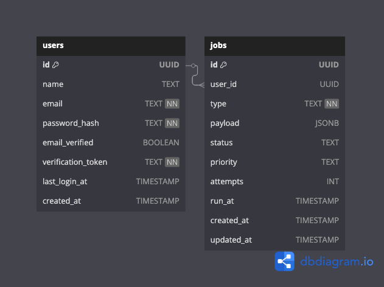

# 🚀 GoQueue – Scalable Job Queue & Task Processing System in Golang

GoQueue is a production-ready, event-driven Job Queue system built with **Golang** and **PostgreSQL**. It’s designed to teach you how to build clean, secure, and scalable backends — with background jobs, scheduling, retries, and real-time updates.

---

## 🧠 Project Objective

> Build a secure, multi-user job queue system where authenticated users can enqueue tasks, track their job statuses, and receive real-time updates when jobs complete — all in pure Go + PostgreSQL.

---

## 📦 Project Structure (Hexagonal Architecture)

```
go-queue/
├── cmd/
│   ├── api/                # HTTP server (REST API)
│   └── worker/             # Background worker runner
├── internal/
│   ├── domain/             # Job/User models, interfaces
│   ├── service/            # Job logic (enqueue, execute, retry)
│   └── repository/         # PostgreSQL implementations
├── migrations/             # SQL files for DB setup
├── common/                 # Shared utilities (JWT, auth)
├── Dockerfile
├── docker-compose.yml
├── go.mod
└── README.md
```

---

## 🔐 Multi-User + JWT Authentication (New)

This system is **secured** so only logged-in users can:
- Submit jobs
- View their own jobs
- Retry or cancel their own jobs

### Auth Features:
- Signup & login endpoints
- Passwords are securely hashed with `bcrypt`
- JWT-based access tokens
- Middleware to protect routes and get the current user

---

## 🚦 Roadmap & Learning Milestones

### ✅ Phase 1: Foundation – REST API + PostgreSQL + Auth

- [ ] Set up project structure with Hexagonal Architecture
- [ ] Add user authentication:
  - [ ] Signup (`POST /signup`)
  - [ ] Login (`POST /login`)
  - [ ] JWT token generation & middleware
- [ ] Create `users` and `jobs` tables
- [ ] REST API for:
  - [ ] Submit job (auth required)
  - [ ] Get job status (auth required)
- [ ] PostgreSQL + SQLx or pgx
- [ ] Docker + Compose setup

---

### ✅ Phase 2: Worker System – Background Task Execution

- [ ] Goroutine-based worker
- [ ] Poll for pending jobs
- [ ] Execute job logic (mocked at first)
- [ ] Retry with backoff
- [ ] Log output & mark as completed/failed

---

### ✅ Phase 3: Scheduling + Priority Queue

- [ ] `run_at` timestamp support
- [ ] `priority` field (`high`, `medium`, `low`)
- [ ] Queue sorted by run_at + priority

---

### ✅ Phase 4: Dashboard + Monitoring

- [ ] Web UI (or CLI) to view jobs by user
- [ ] Retry failed jobs manually
- [ ] Add `/metrics` endpoint for Prometheus
- [ ] Optional: Grafana setup

---

### ✅ Phase 5: WebSocket Notifications (Advanced)

- [ ] Notify logged-in users in real-time when their job completes
- [ ] WebSocket connection with JWT auth
- [ ] Frontend toast/alert when status updates

---

### ✅ Phase 6: Advanced Concepts

- [ ] Dead Letter Queue (failed jobs after N retries)
- [ ] Graceful shutdown with context & signals
- [ ] Redis cache or pub/sub (optional)
- [ ] Deploy to GCP or any cloud
- [ ] CI/CD (GitHub Actions)

---

## 🔐 Database Schema (Users + Jobs)


---

## 🌐 API Endpoints

### 🔑 Auth Routes
- `POST /signup` – Register new user
- `POST /login` – Authenticate and get token

### 📦 Job Routes (require JWT)
- `POST /jobs` – Submit a new job (auth required)
- `GET /jobs/:id` – View job (only if you own it)
- `GET /jobs` – List your jobs (by status, priority)
- `POST /jobs/:id/retry` – Retry failed job

### 📡 Real-Time
- `WS /ws/jobs` – Connect with JWT, get updates

---

## 🚀 Tech Stack

- 🧠 **Language:** Go (Golang)  
- 🗄️ **Database:** PostgreSQL  
- 🔐 **Authentication:** JWT + bcrypt  
- 🌐 **API Framework:** Fiber / Chi  
- 🛢️ **DB Layer:** pgx / SQLx  
- 🧵 **Background Tasks:** Goroutines  
- 🐳 **DevOps & Containerization:** Docker  
- ⚡ **Realtime Communication:** WebSocket  
- ☁️ **Deployment:** GCP / Fly.io  

---

## 🧠 Learnings From This Project

- ✅ Clean, modular Go architecture
- ✅ Job queueing with retries and scheduling
- ✅ Auth-secured APIs with JWT
- ✅ PostgreSQL for relational & task data
- ✅ Real-time systems with WebSocket
- ✅ Dockerized microservices
- ✅ Observability & cloud-readiness

---

## 📚 Resources

- [JWT Authentication in Go](https://dev.to/macisamuele/jwt-authentication-in-go-1j7h)
- [Clean Architecture in Go](https://medium.com/@matryer/structuring-go-applications-clean-architecture-ef7d7c6fcd26)
- [Go Channels and Workers](https://gobyexample.com/worker-pools)
- [Job Queues in Postgres](https://www.crunchydata.com/blog/building-a-job-queue-with-postgresql)

---

## 🤝 Contributors

Made with ❤️ by Sirajum Munir (Nezent)


